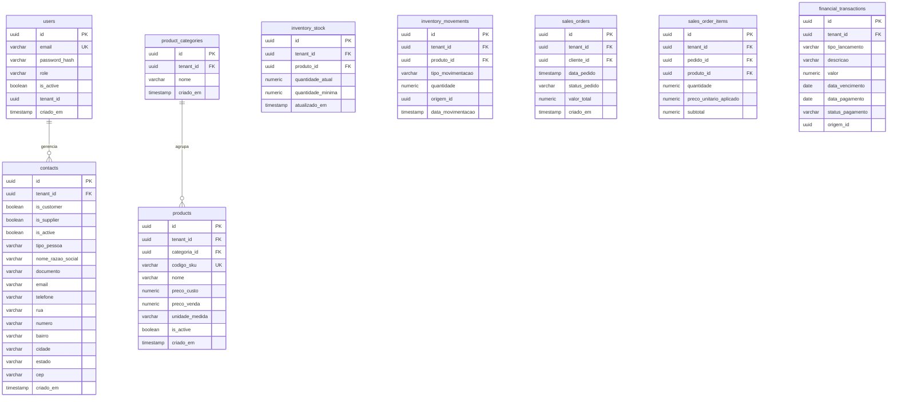

# 🗄️ Modelo de Banco de Dados - Mini ERP

Este documento apresenta o esquema lógico e físico das tabelas do banco de dados PostgreSQL (Supabase), detalhando colunas, chaves primárias (PK), chaves estrangeiras (FK), tipos de dados e regras de integridade.

---

## 🔒 Princípio de Isolamento Multi-tenant (Mitigação de BOLA)

> [!IMPORTANT]
> Em conformidade com o documento de segurança [security.md](./security.md), todas as tabelas operacionais possuem o campo `tenant_id` (UUID). Nenhuma consulta ou escrita no banco de dados deve ser realizada sem o filtro explícito `WHERE tenant_id = <ID_DA_SESSAO>`, garantindo o isolamento total de dados entre diferentes empresas contratantes.

---

## 📊 Diagrama de Entidades e Relacionamentos



---

## 🗃️ Especificação Física das Tabelas (DDL PostgreSQL)

### 1. Tabela `users`
Armazena as contas de acesso dos operadores e administradores do ERP.

```sql
CREATE TABLE users (
    id UUID PRIMARY KEY DEFAULT gen_random_uuid(),
    email VARCHAR(255) NOT NULL UNIQUE,
    password_hash VARCHAR(255) NOT NULL,
    role VARCHAR(20) NOT NULL DEFAULT 'USER', -- ADMIN ou USER
    is_active BOOLEAN NOT NULL DEFAULT TRUE,
    tenant_id UUID NOT NULL, -- Identificador da empresa/conta do cliente
    criado_em TIMESTAMP WITH TIME ZONE DEFAULT CURRENT_TIMESTAMP,
    atualizado_em TIMESTAMP WITH TIME ZONE DEFAULT CURRENT_TIMESTAMP
);
```

### 2. Tabela `contacts`
Tabela unificada para armazenamento de Clientes e Fornecedores.

```sql
CREATE TABLE contacts (
    id UUID PRIMARY KEY DEFAULT gen_random_uuid(),
    tenant_id UUID NOT NULL, -- Isolamento multi-tenant
    is_customer BOOLEAN NOT NULL DEFAULT TRUE, -- Identifica se o contato é cliente
    is_supplier BOOLEAN NOT NULL DEFAULT FALSE, -- Identifica se o contato é fornecedor
    is_active BOOLEAN NOT NULL DEFAULT TRUE, -- Controle de ativação/bloqueio do contato
    tipo_pessoa VARCHAR(2) NOT NULL, -- PF (Pessoa Física) ou PJ (Pessoa Jurídica)
    nome_razao_social VARCHAR(255) NOT NULL,
    documento VARCHAR(20) NOT NULL, -- CPF ou CNPJ (apenas números)
    email VARCHAR(255),
    telefone VARCHAR(20),
    
    -- Endereço desnormalizado para simplificar buscas
    rua VARCHAR(255),
    numero VARCHAR(50),
    bairro VARCHAR(100),
    cidade VARCHAR(100),
    estado VARCHAR(2),
    cep VARCHAR(8),
    
    criado_em TIMESTAMP WITH TIME ZONE DEFAULT CURRENT_TIMESTAMP,
    atualizado_em TIMESTAMP WITH TIME ZONE DEFAULT CURRENT_TIMESTAMP,
    
    -- Garantia de documento único por Tenant (Empresa)
    CONSTRAINT uq_contact_doc_tenant UNIQUE (tenant_id, documento)
);
```

### 3. Tabela `product_categories`
Categorias de produtos para fins de agrupamento e relatórios do ERP.

```sql
CREATE TABLE product_categories (
    id UUID PRIMARY KEY DEFAULT gen_random_uuid(),
    tenant_id UUID NOT NULL, -- Isolamento multi-tenant
    nome VARCHAR(100) NOT NULL,
    criado_em TIMESTAMP WITH TIME ZONE DEFAULT CURRENT_TIMESTAMP,
    atualizado_em TIMESTAMP WITH TIME ZONE DEFAULT CURRENT_TIMESTAMP,
    
    CONSTRAINT uq_category_nome_tenant UNIQUE (tenant_id, nome)
);
```

### 4. Tabela `products`
Catálogo de produtos disponíveis para venda ou compra.

```sql
CREATE TABLE products (
    id UUID PRIMARY KEY DEFAULT gen_random_uuid(),
    tenant_id UUID NOT NULL,
    categoria_id UUID REFERENCES product_categories(id) ON DELETE SET NULL, -- Permite nulo ou deletar categoria sem apagar o produto
    codigo_sku VARCHAR(100) NOT NULL, -- Identificador único comercial do produto
    nome VARCHAR(255) NOT NULL,
    preco_custo NUMERIC(15, 4) NOT NULL DEFAULT 0.00, -- 4 casas decimais para precisão de centavos
    preco_venda NUMERIC(15, 4) NOT NULL DEFAULT 0.00,
    unidade_medida VARCHAR(10) NOT NULL, -- UN, KG, PC, LT
    is_active BOOLEAN NOT NULL DEFAULT TRUE, -- Desativação lógica do produto
    criado_em TIMESTAMP WITH TIME ZONE DEFAULT CURRENT_TIMESTAMP,
    atualizado_em TIMESTAMP WITH TIME ZONE DEFAULT CURRENT_TIMESTAMP,
    
    CONSTRAINT uq_product_sku_tenant UNIQUE (tenant_id, codigo_sku),
    CONSTRAINT chk_preco_venda_positivo CHECK (preco_venda >= 0),
    CONSTRAINT chk_preco_custo_positivo CHECK (preco_custo >= 0)
);
```

### 5. Tabela `inventory_stock`
Saldo atual do estoque físico de cada produto.

```sql
CREATE TABLE inventory_stock (
    id UUID PRIMARY KEY DEFAULT gen_random_uuid(),
    tenant_id UUID NOT NULL,
    produto_id UUID NOT NULL REFERENCES products(id) ON DELETE CASCADE,
    quantidade_atual NUMERIC(15, 4) NOT NULL DEFAULT 0.00,
    quantidade_minima NUMERIC(15, 4) NOT NULL DEFAULT 0.00, -- Para alerta de reposição
    atualizado_em TIMESTAMP WITH TIME ZONE DEFAULT CURRENT_TIMESTAMP,
    
    CONSTRAINT uq_stock_product_tenant UNIQUE (tenant_id, produto_id),
    CONSTRAINT chk_quantidade_minima_positiva CHECK (quantidade_minima >= 0),
    CONSTRAINT chk_quantidade_atual_positiva CHECK (quantidade_atual >= 0) -- Blindagem contra estoque negativo
);
```

### 6. Tabela `inventory_movements`
Registro histórico e rastreável de todas as entradas, saídas e ajustes de inventário.

```sql
CREATE TABLE inventory_movements (
    id UUID PRIMARY KEY DEFAULT gen_random_uuid(),
    tenant_id UUID NOT NULL,
    produto_id UUID NOT NULL REFERENCES products(id) ON DELETE CASCADE,
    tipo_movimentacao VARCHAR(50) NOT NULL, -- ENTRADA_COMPRA, SAIDA_VENDA, AJUSTE_INVENTARIO, PERDA
    quantidade NUMERIC(15, 4) NOT NULL, -- Quantidade movimentada (positiva)
    origem_id UUID, -- Identificador lógico da origem (ID da Venda ou da Compra)
    data_movimentacao TIMESTAMP WITH TIME ZONE DEFAULT CURRENT_TIMESTAMP,
    
    CONSTRAINT chk_quantidade_movimentada_positiva CHECK (quantidade > 0)
);
```

### 7. Tabela `sales_orders`
Pedidos de venda gerados pelo sistema ou integrados via PDV.

```sql
CREATE TABLE sales_orders (
    id UUID PRIMARY KEY DEFAULT gen_random_uuid(),
    tenant_id UUID NOT NULL,
    cliente_id UUID NOT NULL REFERENCES contacts(id),
    data_pedido TIMESTAMP WITH TIME ZONE DEFAULT CURRENT_TIMESTAMP,
    status_pedido VARCHAR(50) NOT NULL DEFAULT 'ORCAMENTO', -- ORCAMENTO, APROVADO, CANCELADO, FATURADO
    valor_total NUMERIC(15, 4) NOT NULL DEFAULT 0.00,
    criado_em TIMESTAMP WITH TIME ZONE DEFAULT CURRENT_TIMESTAMP,
    atualizado_em TIMESTAMP WITH TIME ZONE DEFAULT CURRENT_TIMESTAMP,
    
    CONSTRAINT chk_valor_total_pedido_positivo CHECK (valor_total >= 0)
);
```

### 8. Tabela `sales_order_items`
Itens associados a cada pedido de venda (relacionamento muitos para muitos).

```sql
CREATE TABLE sales_order_items (
    id UUID PRIMARY KEY DEFAULT gen_random_uuid(),
    tenant_id UUID NOT NULL,
    pedido_id UUID NOT NULL REFERENCES sales_orders(id) ON DELETE CASCADE,
    produto_id UUID NOT NULL REFERENCES products(id),
    quantidade NUMERIC(15, 4) NOT NULL,
    preco_unitario_aplicado NUMERIC(15, 4) NOT NULL, -- Salva o valor exato no momento da venda
    subtotal NUMERIC(15, 4) GENERATED ALWAYS AS (quantidade * preco_unitario_aplicado) STORED, -- Cálculo atômico e infalível pelo banco
    
    CONSTRAINT chk_item_quantidade_positiva CHECK (quantidade > 0),
    CONSTRAINT chk_item_preco_positivo CHECK (preco_unitario_aplicado >= 0)
);
```

### 9. Tabela `financial_transactions`
Lançamentos financeiros de Contas a Pagar, Contas a Receber e Fluxo de Caixa.

```sql
CREATE TABLE financial_transactions (
    id UUID PRIMARY KEY DEFAULT gen_random_uuid(),
    tenant_id UUID NOT NULL,
    tipo_lancamento VARCHAR(10) NOT NULL, -- RECEITA (entrada) ou DESPESA (saída)
    descricao VARCHAR(255) NOT NULL, -- Ex: "Venda Pedido #102"
    valor NUMERIC(15, 4) NOT NULL,
    data_vencimento DATE NOT NULL,
    data_pagamento DATE, -- Permite NULL se o título ainda não foi pago
    status_pagamento VARCHAR(50) NOT NULL DEFAULT 'PENDENTE', -- PENDENTE, PAGO, ATRASADO
    origem_id UUID, -- Opcional: FK lógica associando ao Pedido de Venda ou Compra
    criado_em TIMESTAMP WITH TIME ZONE DEFAULT CURRENT_TIMESTAMP,
    atualizado_em TIMESTAMP WITH TIME ZONE DEFAULT CURRENT_TIMESTAMP,
    
    CONSTRAINT chk_valor_financeiro_positivo CHECK (valor > 0)
);
```

---

## ⚡ Índices de Performance (Otimização do PostgreSQL)

Como toda e qualquer consulta neste ERP relacional fará filtros por `tenant_id` (para isolamento BOLA) e relacionamentos por chaves estrangeiras (`JOINs`), é altamente recomendado criar os seguintes índices para garantir a performance e evitar varreduras completas nas tabelas (Sequential Scans):

```sql
-- 1. Índices compostos de Multi-tenant (Melhora filtros de listagem)
CREATE INDEX idx_contacts_tenant ON contacts (tenant_id);
CREATE INDEX idx_products_tenant ON products (tenant_id);
CREATE INDEX idx_sales_orders_tenant ON sales_orders (tenant_id);
CREATE INDEX idx_financial_transactions_tenant ON financial_transactions (tenant_id);

-- 2. Índices para Chaves Estrangeiras (Otimiza JOINs do ERP)
CREATE INDEX idx_products_category ON products (categoria_id);
CREATE INDEX idx_inventory_stock_product ON inventory_stock (produto_id);
CREATE INDEX idx_inventory_movements_product ON inventory_movements (produto_id);
CREATE INDEX idx_sales_orders_cliente ON sales_orders (cliente_id);
CREATE INDEX idx_sales_order_items_pedido ON sales_order_items (pedido_id);
CREATE INDEX idx_sales_order_items_produto ON sales_order_items (produto_id);
```
