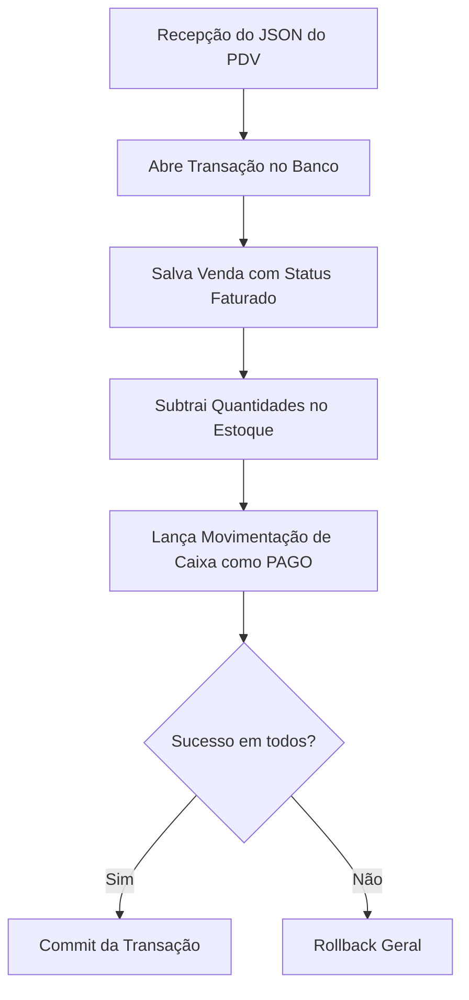

# 🏗️ Arquitetura do Sistema - Mini ERP

Este documento serve como mapa de arquitetura e design de software para a API do Mini ERP. Ele detalha a estrutura de pastas, os módulos de domínio, as convenções de API, os middlewares transversais e as integrações de regras de negócio.

---

## 📁 Estrutura de Diretórios (Clean Architecture Modular)

O projeto adota uma abordagem de **Screaming Architecture**, agrupando o código-fonte por domínios de negócio para facilitar o isolamento lógico, a manutenibilidade e evitar problemas clássicos de importação cíclica no Go.

```text
mini-erp-backend/
├── cmd/
│   └── api/
│       └── main.go           # Ponto de entrada (Inicialização e Injeção de Dependências)
├── internal/
│   ├── auth/                 # Módulo de Autenticação e Gestão de Usuários
│   │   ├── dto.go            # Data Transfer Objects e validações HTTP
│   │   ├── handler.go        # Camada de entrega HTTP (Echo)
│   │   ├── model.go          # Entidade User (ADMIN/USER, status ativo/inativo)
│   │   ├── repository.go     # Acesso ao banco para credenciais
│   │   ├── routes.go         # Rotas comuns e administrativas (RBAC)
│   │   └── service.go        # Lógica de registro, login e alteração de privilégios
│   ├── contact/              # Módulo de Contatos (Clientes e Fornecedores)
│   │   ├── dto.go
│   │   ├── handler.go
│   │   ├── model.go          # Entidade Contact (is_customer, is_supplier, is_active, tipo_pessoa e endereço)
│   │   ├── repository.go
│   │   ├── routes.go
│   │   └── service.go
│   ├── product/              # Módulo de Produtos
│   │   ├── dto.go
│   │   ├── handler.go
│   │   ├── model.go          # Entidades Product e Category (SKU, preços, unidade, is_active)
│   │   ├── repository.go
│   │   ├── routes.go
│   │   └── service.go
│   ├── inventory/            # Módulo de Estoque
│   │   ├── dto.go
│   │   ├── handler.go
│   │   ├── model.go          # Saldo atual (estoque >= 0) e logs de movimentação com origem_id
│   │   ├── repository.go
│   │   ├── routes.go
│   │   └── service.go
│   ├── sale/                 # Módulo de Vendas
│   │   ├── dto.go
│   │   ├── handler.go
│   │   ├── model.go          # Pedidos de venda e itens (subtotal gerado automaticamente pelo banco)
│   │   ├── repository.go
│   │   ├── routes.go         # Endpoints de faturamento e o endpoint especial de PDV
│   │   └── service.go        # Regras de orquestração de vendas e gatilhos automáticos
│   ├── finance/              # Módulo Financeiro
│   │   ├── dto.go
│   │   ├── handler.go
│   │   ├── model.go          # Contas a pagar, contas a receber e fluxo de caixa
│   │   ├── repository.go
│   │   ├── routes.go
│   │   └── service.go
│   └── middleware/           # Middlewares Transversais da Aplicação
│       ├── auth.go           # Validação de token JWT e injeção do usuário no Contexto Echo
│       ├── rbac.go           # Validação de permissões de cargo (ADMIN vs USER)
│       ├── logger.go         # Registro estruturado de logs de chamadas à API
│       └── ratelimit.go      # Limitador de requisições por IP do cliente
├── decisions/                # ADRs (Decisões de Arquitetura Aceitas)
├── architecture/             # Documentação técnica do sistema (Este arquivo)
├── tasks/                    # Organização e controle de checklists de tarefas
└── playbooks/                # Manuais de processos de build, banco e deploy
```

---

## 🛠️ O Padrão de Camadas de Domínio (6 Arquivos)

Cada subdiretório em `internal/[modulo_dominio]` organiza suas responsabilidades internas em no máximo 6 arquivos rodando sob o mesmo pacote do Go (`package nome_do_modulo`), evitando a necessidade de imports cruzados internos:

| Arquivo | Camada Lógica | Função e Responsabilidade |
| :--- | :--- | :--- |
| **`model.go`** | Domain (Entidades) | Estruturas de dados de domínio puras e definição de interfaces que o módulo necessita para persistência (ex: `Repository interface`). |
| **`dto.go`** | Application (DTOs) | Structs de Request e Response com tags de serialização JSON e validação do Echo, isolando os modelos do banco de dados das requisições web. |
| **`service.go`** | Domain (Negócio) | O "coração" do módulo. Executa regras de validação lógica e orquestração de dados. Depende puras e unicamente do `model.go`. |
| **`repository.go`** | Infrastructure (Banco) | Implementa a persistência concreta declarada no `model.go` executando queries em **SQL Puro** com a conexão ativa do `pgx/v5`. |
| **`handler.go`** | Adapter (Apresentação) | Captura dados HTTP vindos do Echo, decodifica para DTOs, invoca o respectivo Service e responde com o DTO adequado e código HTTP correspondente. |
| **`routes.go`** | Router (Mapeamento) | Registra e associa os endpoints do domínio a seus Handlers, aplicando os middlewares de rotas caso aplicável. |

---

## 🌐 Convenções e Versionamento de API

Toda a API RESTful exposta pelo servidor HTTP Echo seguirá um padrão rígido de versionamento de rotas, segurança e formatação de respostas:

*   **Versionamento Global:** O prefixo `/api/v1/` é obrigatório em todas as rotas de negócios. Ele é configurado centralmente no `cmd/api/main.go` no roteador global do Echo.
*   **Padrão do Token de Autenticação:** A autenticação das rotas protegidas é realizada via cabeçalho HTTP padrão, enviando o token JWT gerado pelo módulo `auth`:
    *   `Authorization: Bearer <TOKEN_JWT_AQUI>`
*   **Controle Administrativo (ADM/RBAC):**
    *   A tabela de usuários no banco de dados armazena o cargo do usuário (`role`: `ADMIN` ou `USER`) e seu status de atividade (`is_active`: `true` ou `false`).
    *   Endpoints administrativos no módulo `auth` (como desativação de usuários e listagem geral de contas) são interceptados pelos middlewares `middleware.Auth` (que decodifica o token JWT) e `middleware.RBAC("ADMIN")` (que bloqueia o acesso caso a role não seja administrativa).
*   **Padrão de Respostas e Erros da API:** Para garantir a consistência das integrações e facilitar o consumo pelo frontend ou pelo PDV, a API responderá erros sob o seguinte contrato JSON estruturado:
    ```json
    {
      "error": "Descrição clara e genérica do erro para o cliente",
      "details": ["Campo 'email' é obrigatório", "O documento fornecido é inválido"]
    }
    ```

---

## 🗄️ Versionamento do Banco de Dados (Migrations)

O controle e a evolução do esquema do banco de dados PostgreSQL (no Supabase e localmente) são gerenciados de forma explícita e controlada:

*   **Padrão de Arquivos:** As alterações de banco são organizadas na pasta `migrations/` na raiz do projeto, utilizando scripts em SQL Puro numerados sequencialmente em pares de subida (*up*) e descida (*down*):
    *   `000001_initialize_schema.up.sql` (Inicialização de tabelas/índices do ERP)
    *   `000001_initialize_schema.down.sql` (Reversão completa das alterações)
*   **Execução:** A execução das migrações em ambientes locais e de produção será feita via utilitário de linha de comando ou script de automação documentado, garantindo que o banco de dados esteja sempre sincronizado com o código.

---

## 🔗 Integrações Automáticas e Gatilhos de Negócio

Para que o ERP funcione de maneira integrada e autônoma, o sistema aciona gatilhos automáticos de atualização no momento em que uma venda é finalizada. 

> [!IMPORTANT]
> Essas integrações de dependência entre módulos são implementadas por **Inversão de Dependências (DIP)**. O pacote `sale` declara as interfaces de estoque e financeiro que ele precisa localmente, e o `main.go` injeta as dependências de forma que os pacotes de domínio nunca se importem diretamente (eliminando riscos de ciclos de importação).

### 1. Gatilho de Estoque
*   **Gatilho:** Quando um pedido de venda (`sale`) é alterado para o status `Aprovado`/`Faturado`.
*   **Ação:** O sistema chama o módulo `inventory` para realizar a baixa física das quantidades vendidas e registra um histórico de movimentação do tipo `Saída por Venda`.

### 2. Gatilho Financeiro
*   **Gatilho:** Quando um pedido de venda (`sale`) é faturado.
*   **Ação:** O sistema chama o módulo `finance` para criar automaticamente uma transação do tipo `Receita` com o status `Pendente` (ou `Pago`, se for venda PDV) relacionada à origem daquela venda.

---

## 🏪 Fluxo Expresso de Venda (PDV - Ponto de Venda)

Para suportar operações de Frente de Caixa que necessitam de rapidez e consistência absoluta, o módulo `sale` disponibiliza um endpoint especializado:

`POST /api/v1/sales/pdv`

### Comportamento Transacional ACID
Diferente do fluxo tradicional onde cada etapa é manual ou assíncrona, este endpoint executa as 3 etapas seguintes sob uma única transação atômica de banco de dados (`BEGIN TRANSACTION` / `COMMIT` / `ROLLBACK`):



Se qualquer uma das operações internas falhar por qualquer motivo (como falta de estoque ou dados inválidos), o banco realiza um `rollback` completo, garantindo que o ERP nunca fique com dados inconsistentes.
